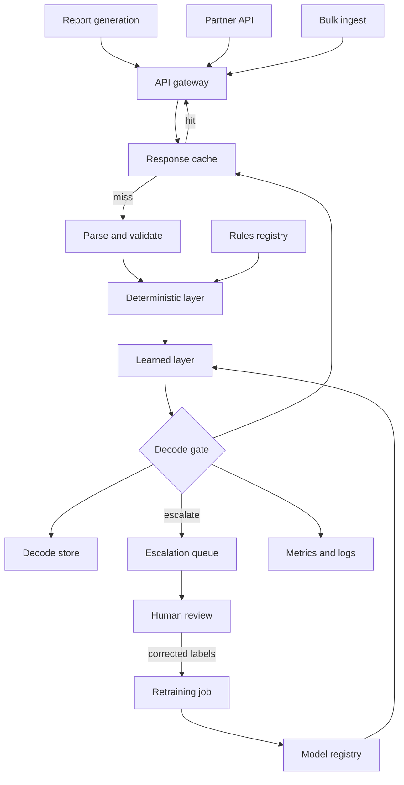

# Production architecture

The service in this repository is the shaded box. Everything around it is
what a high-volume deployment needs, and is offered for discussion rather
than implemented.

## Notes on the choices

**The cache is keyed per field, not per response.** Positions 1–9 are the
entire feature vector for the learned fields, so two VINs sharing a prefix
have identical `model` and `body` decodes — that part caches on the prefix,
plus the model-artifact version.

The whole response does not. `year` depends on position 10 *and* on whether
the check digit validates, which is computed over all seventeen characters:
`WBA3N3C51EK200000` and `WBA3N3C51EK200001` share their first ten characters
and get `RULE` and `ESCALATE` respectively. A truncated response key would
serve one car's verdict for another's. The response cache key is therefore
the full normalised VIN together with the rules-registry and model versions,
so a register update invalidates cleanly instead of serving stale verdicts.
Getting this wrong is how a decoder starts returning confidently wrong
years at cache-hit speed.

**Rules and models are separate artifacts with separate lifecycles.** A new
WMI is a data change and should ship without retraining or redeploying.
Bundling them is what makes a decoder slow to correct.

**Escalations are a queue, not an error.** They route to review and come back
as the highest-value training labels available — the cases the model
demonstrably could not resolve.

**Monitoring watches the verdict mix.** Ground truth for VIN decoding arrives
late or never, so accuracy is not observable in real time. The share of
`ESCALATE` and `UNKNOWN` verdicts is observable immediately and moves as soon
as the input distribution does. That is the alert worth paging on.

**The decode store is split the same way.** Learned fields are stored per
prefix, which is where the duplication actually collapses; the rule-derived
fields and the final verdicts are stored per VIN, because they differ per
VIN. Storing everything per VIN would duplicate identical model and body
decodes millions of times over; storing everything per prefix would corrupt
the year. Full VINs belong in the audit log regardless — and the redaction in
the training data suggests that distinction already matters here.
